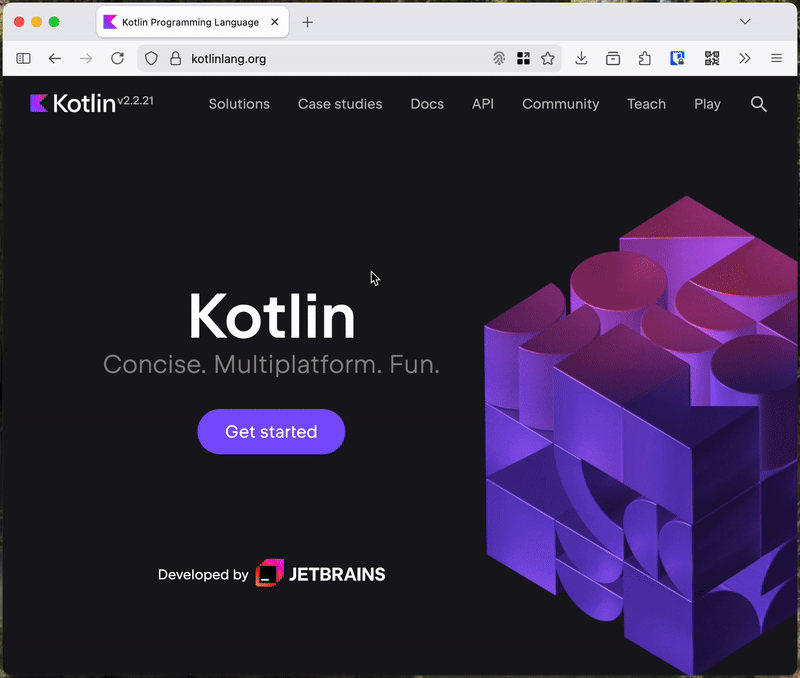
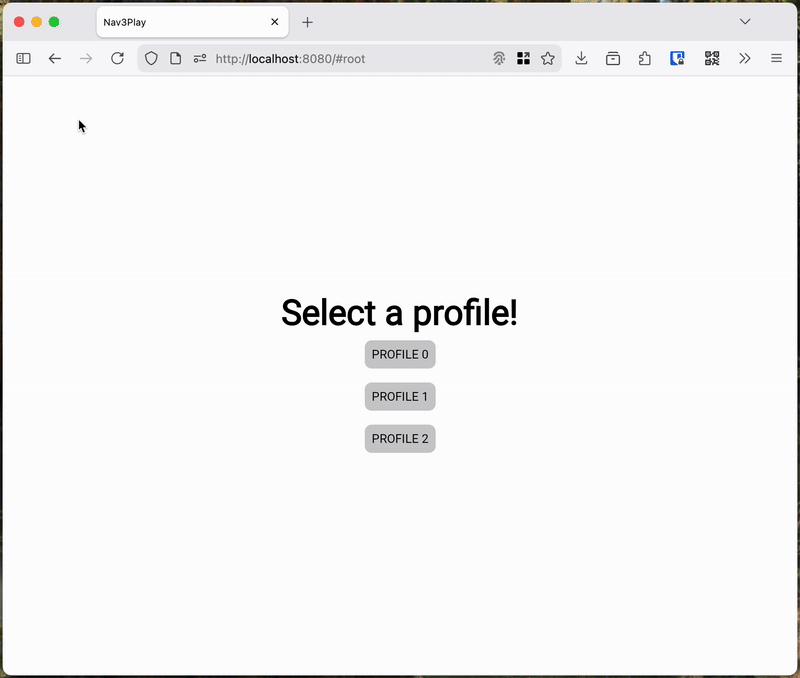
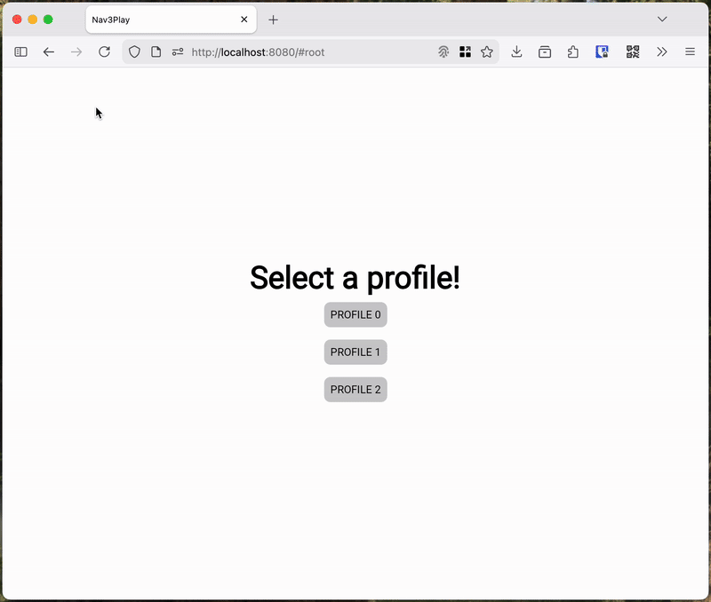

## [navigation3-browser]
#### androidx.navigation3 browser integration


A tiny library to integrate [Androidx.Navigation3](https://developer.android.com/guide/navigation/navigation-3) with [Browser History](https://developer.mozilla.org/en-US/docs/Web/API/History_API)!  

---

To better understand how it works and what API exists,  
watch the following video and answer: 

### Question:
**what screen do you expect to see when you click the back button in the browser?**



### Answers:
<details>
<summary><h3>Chronological Navigation:</h3> Return to the page you just closed [PROFILE 2]</summary>



We will call this type of navigation **chronological**.  
This is how standard web applications, such as Wikipedia or GitHub, usually behave.  
The idea is that the browser history stores a stack of all screen changes in chronological order.  
This allows you to move back and forth between these states.  
This can be very convenient, but it allows for unplanned transitions within the application.

### Pros:
 - close to default desktop web browser behavior
 - supports navigation through the browser address bar
 - there is back and forth navigation between saved states

### Cons:
 - bound to only one navigation backstack
 - may provide unusual navigation behavior (e.g. open closed dialogs by back button)

</details>

<details>
<summary><h3>Hierarchical Navigation:</h3> Return to kotlinlang.org</summary>



We will call this type of navigation **hierarchical**.  
That is, it is related to the current hierarchy of screens in the application.  
This is how regular applications in the system usually behave.  
From the main screen, you can only exit the application completely.  
This type of navigation does not imply “forward” navigation,  
but when you click back, you can perform some action,  
such as displaying a dialog asking if the user wants to leave the application.  
**This type of navigation is also more convenient to use from a mobile browser.**

### Pros:
 - supports any backstack nesting
 - behaves like a regular mobile application
 - does not allow unplanned navigation

### Cons:
 - does not support navigation through the browser address bar
 - does not support forward navigation

</details>

### Demo app:
https://terrakok.github.io/navigation3-browser/

## How to use
#### Add dependency:
Latest version: [](https://central.sonatype.com/artifact/com.github.terrakok/navigation3-browserg)
```kotlin
kotlin {
    //...
    sourceSets {
        //...
        val webMain by getting {
            dependencies {
                implementation("com.github.terrakok:navigation3-browser:[LATEST VERSION]")
            }
        }
    }
}
```

⚠️ You are supposed to select needed type and to configure BrowserHistory integration **only once** in your application.  
You can do it depending on a browser type: **Desktop or Mobile**.

#### Chronological Navigation:
```kotlin
data object Root
data class Profile(val id: Int)

@Composable
fun App() {
    val backStack = remember { mutableStateListOf<Any>(Root) }
    ChronologicalBrowserNavigation(
        backStack = backStack,
        saveKey = { key ->
            when (key) {
                is Root -> buildBrowserHistoryFragment("root")
                is Profile -> buildBrowserHistoryFragment("profile", mapOf("id" to key.id.toString()))
                else -> null
            }
        },
        restoreKey = { fragment ->
            when (getBrowserHistoryFragmentName(fragment)) {
                "root" -> Root
                "profile" -> Profile(
                    getBrowserHistoryFragmentParameters(fragment).getValue("id")?.toInt()
                        ?: error("id is required")
                )
                else -> null
            }
        }
    )
    NavDisplay(backStack) {...}
}
```
#### Hierarchical Navigation:
```kotlin
data object Root
data class Profile(val id: Int)

@Composable
fun App() {
    val backStack = remember { mutableStateListOf<Any>(Root) }
    HierarchicalBrowserNavigation(
        currentDestinationName = {
            when (val key = backStack.lastOrNull()) {
                is Root -> buildBrowserHistoryFragment("root")
                is Profile -> buildBrowserHistoryFragment("profile", mapOf("id" to key.id.toString()))
                else -> null
            }
        },
    )
    NavDisplay(backStack) {...}
}
```

## License
```
MIT License

Copyright (c) 2024 Konstantin Tskhovrebov (@terrakok)

Permission is hereby granted, free of charge, to any person obtaining a copy
of this software and associated documentation files (the "Software"), to deal
in the Software without restriction, including without limitation the rights
to use, copy, modify, merge, publish, distribute, sublicense, and/or sell
copies of the Software, and to permit persons to whom the Software is
furnished to do so, subject to the following conditions:

The above copyright notice and this permission notice shall be included in all
copies or substantial portions of the Software.

THE SOFTWARE IS PROVIDED "AS IS", WITHOUT WARRANTY OF ANY KIND, EXPRESS OR
IMPLIED, INCLUDING BUT NOT LIMITED TO THE WARRANTIES OF MERCHANTABILITY,
FITNESS FOR A PARTICULAR PURPOSE AND NONINFRINGEMENT. IN NO EVENT SHALL THE
AUTHORS OR COPYRIGHT HOLDERS BE LIABLE FOR ANY CLAIM, DAMAGES OR OTHER
LIABILITY, WHETHER IN AN ACTION OF CONTRACT, TORT OR OTHERWISE, ARISING FROM,
OUT OF OR IN CONNECTION WITH THE SOFTWARE OR THE USE OR OTHER DEALINGS IN THE
SOFTWARE.
```